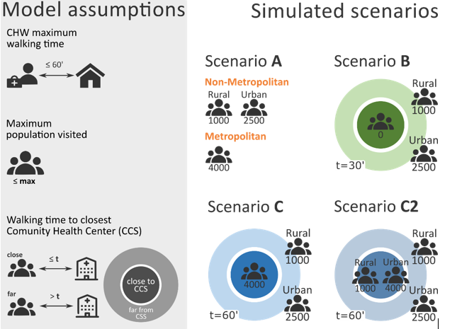

```{r knitr setup, include=FALSE}

########################################
# CODE WRITTEN BY SAMUEL BAZAZ JAZAYERI
########################################

## To have traceback of Knitr
trace(recover, sink)

# ||||||||||||||||||||||||||||||||||||||||||||||||||||||||||||||||||||||||||

# don't use knit button but rmarkdown::render(path_of_Rmd) instead 
# knit button doesn't work with tricky packages

#||||||||||||||||||||||||||||||||||||||||||||||||||||||||||||||||||||||||||||||

knitr::opts_chunk$set(tidy = TRUE, tidy.opts = list(comment = FALSE),echo = FALSE, warning = FALSE, 
                      error = FALSE,R.options = list(error = recover) )

```

> Authors: Clara Champagne, Andrew Sunil Rajkumar, Paul Auxila, Giulia Perrone, Marvin Plötz, Alyssa Young, Samuel Bazaz Jazayeri, Harriet Napier, Arnaud Le Menach, Katherine Battle, Punam Amratia, Ewan Cameron, Jean-Patrick Alfred, Yves-Gaston Deslouches, Emilie Pothin  


```{r data path, include=FALSE,eval=TRUE}

path_to_box="C:/Users/chamcl/Box/Swiss TPH country modelling/1. Country Support/Haiti/8. Communication/Manuscripts/CHWplacement"

main_path=paste0(path_to_box, "/input_data/inputs_visualisation/") 
scenar_path <- paste0( main_path, "scenarios/"  )

# for knitting
path_of_Rmd <- "/Users/chamcl/Documents/git_repositories/GitHubRepos/CHWplacement/demo/haiti/Haiti_CHW_Visualization.Rmd"

```

```{r load libraries, include = FALSE, eval = TRUE, message = F, warning = F}

library(knitr)
library(magrittr)
library(dplyr)
library(spdplyr)

library(leaflet)
library(leaflet.extras)
library(raster)
library(rgdal)
library(sp)

library(viridis)
library(kableExtra)

library(devtools)

# For knitr->JS

#webshot::install_phantomjs()


#-----------Optional--------------------

## For "Onrender" (to add title to the checkbox)

# library(htmltools)
# install_github('ramnathv/htmlwidgets')
# library(htmlwidgets)

### ---------------------------------For Bugs--------------------------------------------

## sometimes some conflicts happends beetween raster, dplyr and spdyplr
## First reinstall vctrs

#install.packages("vctrs")

## If it doesn't work, reinstall raster and dplyr then vctrs

```


```{r load data , include = FALSE, eval = TRUE}

#' `pop`        population
#' `frict`      friction
#' `urb_ru`     urban_rural
#' `t_to_CCS`   time to community health centre (CCS)
#' `Admin4`     Locality
#' `Admin2`     Communes
#' `scen_X`     scenario X
#' `cap_Dec`    capacity Decreased
#' `cap_Inc`    capacity Increased
#' `mUD_xxx`    minimum of Density to be considered as Urban area = xxx  habitants / km^2
#' `mUP_xxxx`   minimum of Population to be considered as Urban area = xxxx habitants 
#' `tCCS_xx`    thresholds of time to CCS for be considered as hard to reach areas = xx min
#' `tW_xx`      thresholds of walking time between CHW and houses (radius) = xx min

# -------------------------------------Inputs---------------------------------------------
  # tif 


pop      = raster( paste0( main_path, "population_haiti.tif"  ) )
frict    = raster( paste0( main_path, "friction_haiti.tif"    ) ) 
urb_ru   = raster( paste0( main_path, "urban_rural_haiti.tif" ) ) 
t_to_CCS = raster( paste0( main_path, "time2CCS_haiti.tif"    ) ) 

#removes NA coordinates in rasters in order to add legends with trim()
pop       %<>% trim() 
frict     %<>% trim() 
urb_ru    %<>% trim() 
t_to_CCS  %<>% trim()

# Convert friction to Minutes/km

values(frict) <- values(frict)*1000

  # shp


Admin4_shp <- paste0( main_path, "seccom_shapefile.shp" ) %>% 
              readOGR(verbose = FALSE, encoding = 'UTF-8', use_iconv = TRUE ) %>% 
              dplyr::select("NAME_4") %>% 
              dplyr::rename( "Section_Communale"= "NAME_4")


Admin2_shp <- paste0( main_path, "Haiti Commune/Admin2_proj.shp") %>% 
              readOGR(verbose = FALSE, encoding = 'UTF-8', use_iconv = TRUE ) %>% 
              dplyr::select("Commune", "Longitude", "Latitude" ) 
Admin2_shp %<>% spTransform( CRS("+proj=longlat +datum=WGS84 +no_defs "))


CCS        <-   paste0( main_path, "CCS_positions.shp"    ) %>% 
                readOGR(verbose = FALSE, encoding = 'UTF-8', use_iconv = TRUE )
CCS        %<>% mutate(lon = coordinates(CCS)[,1], lat = coordinates(CCS)[,2]) %>%  # GPS positions
                dplyr::filter(lon < -70, lat > 18) #remove strange values around long=0,lat=0 of CCS


# -------------------------------------Outputs( scenarios )---------------------------------

# The format choosen is SpatialPointsDataFrame in order to easely construct maps of CHW's number

def_scen = function(file){
           return (  read.csv( paste0( scenar_path, file  ) ) %>% 
                     dplyr::select( x, y ) %>% 
                     dplyr::filter( !is.na(x) )   %>% dplyr::filter( !is.na(y) ) %>%
                     SpatialPointsDataFrame( coords = .[,c("x","y")], data = .,
                                           proj4string = Admin2_shp@proj4string) )
}
#def_scen( "scenarioB.csv"   )
  # basics
scen_A  = def_scen( "scenarioA.csv"   ) 
scen_B  = def_scen( "scenarioB.csv"   )
scen_C  = def_scen( "scenarioC.csv"   )  
scen_C2 = def_scen( "scenarioC2.csv"  )

  # C variants

scen_C_cap_Dec  = def_scen("scenarioC_capacityDecreased.csv" ) 
scen_C_cap_Inc  = def_scen("scenarioC_capacityIncreased.csv" ) 

scen_C_mUD_270  = def_scen("scenarioC_minDensUrb270.csv"     ) 
scen_C_mUD_330  = def_scen("scenarioC_minDensUrb330.csv"     ) 

scen_C_mUP_1800 = def_scen("scenarioC_minPopUrb1800.csv"     )
scen_C_mUP_2200 = def_scen("scenarioC_minPopUrb2200.csv"     ) 

scen_C_tCCS_54  = def_scen("scenarioC_timeCCS54.csv"         ) 
scen_C_tCCS_66  = def_scen("scenarioC_timeCCS66.csv"         ) 

scen_C_tW_54    = def_scen("scenarioC_walkingtime54.csv"     ) 
scen_C_tW_66    = def_scen("scenarioC_walkingtime66.csv"     ) 

```


```{r add nb CHW by Adminx by scenarios , include = FALSE, eval = TRUE}


Add_CHW_Admin2= function( scen ){
  
  return( merge(Admin2_shp, 
                scen %>%  
                    over( Admin2_shp ) %>% 
                    filter( !is.na( Commune ) ) %>%
                    group_by( Commune ) %>%
                    summarise( scen_ = n() ) %>%
                    ungroup(), 
                  by = "Commune" ) %>%
          mutate( scen_ = ifelse(is.na(scen_), 0, scen_) ))
  
}


    test <-scen_C_cap_Dec %>%  
                    over( Admin2_shp ) %>% 
                    filter( !is.na( Commune ),  )

Add_CHW_Admin4= function( scen ){
  
  return( merge(Admin4_shp, 
                scen %>%  
                    over( Admin4_shp ) %>% 
                    filter( !is.na( Section_Communale ) ) %>%
                    group_by( Section_Communale ) %>%
                    summarise( scen_ = n() ) %>%
                    ungroup(), 
                  by = "Section_Communale" )%>%
          mutate( scen_ = ifelse(is.na(scen_), 0, scen_) ))
  
}

Admin2_shp = Add_CHW_Admin2(scen_A)  %>% rename( scen_A  = "scen_")
Admin4_shp = Add_CHW_Admin4(scen_A)  %>% rename( scen_A  = "scen_")

Admin2_shp = Add_CHW_Admin2(scen_B)  %>% rename( scen_B  = "scen_")
Admin4_shp = Add_CHW_Admin4(scen_B)  %>% rename( scen_B  = "scen_")

Admin2_shp = Add_CHW_Admin2(scen_C)  %>% rename( scen_C  = "scen_")
Admin4_shp = Add_CHW_Admin4(scen_C)  %>% rename( scen_C  = "scen_")

Admin2_shp = Add_CHW_Admin2(scen_C2) %>% rename( scen_C2 = "scen_")
Admin4_shp = Add_CHW_Admin4(scen_C2) %>% rename( scen_C2 = "scen_")


Admin2_shp = Add_CHW_Admin2(scen_C_cap_Dec)  %>% rename( scen_C_cap_Dec  = "scen_")
Admin4_shp = Add_CHW_Admin4(scen_C_cap_Dec)  %>% rename( scen_C_cap_Dec  = "scen_")

Admin2_shp = Add_CHW_Admin2(scen_C_cap_Inc)  %>% rename( scen_C_cap_Inc  = "scen_")
Admin4_shp = Add_CHW_Admin4(scen_C_cap_Inc)  %>% rename( scen_C_cap_Inc  = "scen_")

Admin2_shp = Add_CHW_Admin2(scen_C_mUD_270)  %>% rename( scen_C_mUD_270  = "scen_")
Admin4_shp = Add_CHW_Admin4(scen_C_mUD_270)  %>% rename( scen_C_mUD_270  = "scen_")

Admin2_shp = Add_CHW_Admin2(scen_C_mUD_330)  %>% rename( scen_C_mUD_330  = "scen_")
Admin4_shp = Add_CHW_Admin4(scen_C_mUD_330)  %>% rename( scen_C_mUD_330  = "scen_")

Admin2_shp = Add_CHW_Admin2(scen_C_mUP_1800) %>% rename( scen_C_mUP_1800 = "scen_")
Admin4_shp = Add_CHW_Admin4(scen_C_mUP_1800) %>% rename( scen_C_mUP_1800 = "scen_")

Admin2_shp = Add_CHW_Admin2(scen_C_mUP_2200) %>% rename( scen_C_mUP_2200 = "scen_")
Admin4_shp = Add_CHW_Admin4(scen_C_mUP_2200) %>% rename( scen_C_mUP_2200 = "scen_")

Admin2_shp = Add_CHW_Admin2(scen_C_tCCS_54)  %>% rename( scen_C_tCCS_54  = "scen_")
Admin4_shp = Add_CHW_Admin4(scen_C_tCCS_54)  %>% rename( scen_C_tCCS_54  = "scen_")

Admin2_shp = Add_CHW_Admin2(scen_C_tCCS_66)  %>% rename( scen_C_tCCS_66  = "scen_")
Admin4_shp = Add_CHW_Admin4(scen_C_tCCS_66)  %>% rename( scen_C_tCCS_66  = "scen_")

Admin2_shp = Add_CHW_Admin2(scen_C_tW_54)    %>% rename( scen_C_tW_54    = "scen_")
Admin4_shp = Add_CHW_Admin4(scen_C_tW_54)    %>% rename( scen_C_tW_54    = "scen_")

Admin2_shp = Add_CHW_Admin2(scen_C_tW_66)    %>% rename( scen_C_tW_66    = "scen_")
Admin4_shp = Add_CHW_Admin4(scen_C_tW_66)    %>% rename( scen_C_tW_66    = "scen_")

```


```{r palettes and icon , include = FALSE, eval = TRUE}

# warning in order to add legend palette with colorNumeric are needed to handle NA values

pal_pop     <- colorNumeric( "inferno", domain = c(minValue(pop), maxValue(pop)), na.color = "transparent", reverse = TRUE )

pal_frict   <- colorNumeric( c("#0C2C84", "#41B6C4", "#FFFFCC"), domain = values(frict), na.color = "transparent", reverse = TRUE )

pal_urb     <- colorFactor( c("palegreen3", "slategray3"), domain = values(urb_ru),na.color = "transparent")

pal_to_CCS  <- colorNumeric( "YlOrBr", domain = values(t_to_CCS),  na.color = "transparent")

pal_blue    <- colorNumeric( "blue", domain = c(1,1),  na.color = "transparent")


# Icons for CCS

url_1  <- "https://e7.pngegg.com/pngimages/977/124/png-clipart-round-green-cross-icon-hospital-nurse-in-vitro-fertilisation-medicine-health-ambulance-cross-hospital-icon-miscellaneous-service-thumbnail.png"

medic_Icon  <- makeIcon(iconUrl = url_1, iconWidth = 13, iconHeight = 13)

```

\
\

# CHW placement scenarios
<!-- \ -->
<!-- \ -->

<!--  -->
<!-- \ -->
<!-- \ -->


```{r plot basics, eval = TRUE, message = F, warning = F}

leaflet() %>%
  
  # Background and Start
  addProviderTiles( providers$CartoDB.Positron ) %>% 
  addPolygons( data = Admin4_shp, group = "Communal Sections", 
               color = "#444444", weight = .2, fillOpacity = 0, 
               highlightOptions = highlightOptions(weight = 2, color = 'black'),
               popup  = paste0(
                 "Number of CHWs in the Communal Section", "<br>",
                 "<b>",Admin4_shp$Section_Communale, "</b><br>",
                 "Scenario A:<b>  " , Admin4_shp$scen_A, "</b><br>",
                 "Scenario B:<b>  " , Admin4_shp$scen_B, "</b><br>",
                 "Scenario C:<b>  " , Admin4_shp$scen_C, "</b><br>",
                 "Scenario C2:<b> " , Admin4_shp$scen_C2, "</b>"        )
               ) %>% 
  
  addPolygons( data = Admin2_shp, group = "Communes", 
               color = "#444444", weight = .2, fillOpacity = 0,                       
               highlightOptions = highlightOptions(weight = 2, color = 'black'),
               popup  = paste0(
                 "Number of CHWs in the Commune", "<br>",
                 "<b>",Admin2_shp$Commune, "</b><br>",
                 "Scenario A:<b>  " , Admin2_shp$scen_A, "</b><br>",
                 "Scenario B:<b>  " , Admin2_shp$scen_B, "</b><br>",
                 "Scenario C:<b>  " , Admin2_shp$scen_C, "</b><br>",
                 "Scenario C2:<b> " , Admin2_shp$scen_C2, "</b>"        )
               ) %>%
  setView( lng = mean( Admin2_shp$Longitude ), lat = mean( Admin2_shp$Latitude ), zoom = 08 ) %>%
  
  # Inputs

  addMarkers( data = CCS, lng = ~LONGNUM, lat = ~LATNUM, icon = medic_Icon, group = "CCS" , options = markerOptions( opacity = .5) ) %>%   
  addMarkers( data = CCS, lng = ~LONGNUM, lat = ~LATNUM, icon = medic_Icon, group = "CCS" , options = markerOptions( opacity = .5) ) %>%   
  
  addRasterImage( pop,      colors = pal_pop,   opacity = .7, group = "Population"  ) %>% 
  addLegend( data = pop,    values = values(pop)  , pal = pal_pop, position = "bottomleft", 
             title = "Population",     opacity = 1, group = "Population"            ) %>%
  
  addRasterImage( frict,    colors = pal_frict, opacity = .7,  group = "Friction"    ) %>% 
  addLegend( data = frict,  values = values(frict), pal = pal_frict, position = "bottomleft",
             title = "Friction (minutes/km)",       opacity = 1, group = "Friction"              ) %>%
  
  addRasterImage( urb_ru,   colors = pal_urb,   opacity = .4,  group = "Urban or Rural" ) %>%
  addLegend( data = urb_ru, values = values(urb_ru), pal = pal_urb, position = "bottomleft",
             title = "urban (1) or rural (0)", opacity = 1, group = "Urban or Rural"           ) %>%


  addRasterImage( t_to_CCS, colors = pal_to_CCS, opacity = .5,  group = "Walking time to CCS" ) %>%
  addLegend( data = t_to_CCS, values = values(t_to_CCS), pal = pal_to_CCS, position = "bottomleft",
             title = "Walking time to CCS (minutes)",   opacity = 1, group = "Walking time to CCS"           ) %>%
  
  # Outputs
  addCircleMarkers( data = scen_A, lng = ~x, lat = ~y, color ="orange", stroke = FALSE, fillOpacity = 0.5, group = "Scenario A (orange)",
      clusterOptions = markerClusterOptions( iconCreateFunction = JS(
      "function (cluster) {    
        var childCount = cluster.getChildCount();  
        if (childCount < 100) {  
          c = 'rgba(242, 167, 54, .5);'
        } else if (childCount < 1000) {  
          c = 'rgba(242, 110, 54, .5);'  
        } else { 
          c = 'rgba(242, 54, 54, .5);'  
        }    
        return new L.DivIcon({ html: '<div style=\"background-color:'+c+'\"><span>' + childCount + '</span></div>', className: 'marker-cluster', iconSize: new L.Point(40, 40) });
    
      }" )))    %>%
  
    addCircleMarkers( data = scen_B, lng = ~x, lat = ~y, color ="green", stroke = FALSE, fillOpacity = 0.3, group = "Scenario B (green)",
      clusterOptions = markerClusterOptions( iconCreateFunction = JS(
      "function (cluster) {    
        var childCount = cluster.getChildCount();  
        if (childCount < 100) {  
          c = 'rgba(105, 223, 131, .5);'
        } else if (childCount < 1000) {  
          c = 'rgba(105, 229, 23, .5);'  
        } else { 
          c = 'rgba(197, 228, 0, .7);'  
        }    
        return new L.DivIcon({ html: '<div style=\"background-color:'+c+'\"><span>' + childCount + '</span></div>', className: 'marker-cluster', iconSize: new L.Point(40, 40) });
    
      }" )))    %>%
  
      addCircleMarkers( data = scen_C, lng = ~x, lat = ~y, color ="#275EB2", stroke = FALSE, fillOpacity = 0.3, group = "Scenario C (blue)",
      clusterOptions = markerClusterOptions( iconCreateFunction = JS(
      "function (cluster) {    
        var childCount = cluster.getChildCount();  
        if (childCount < 100) {  
          c = 'rgba(89, 150, 191, .5);'
        } else if (childCount < 1000) {  
          c = 'rgba(97, 195, 210, .5);'  
        } else { 
          c = 'rgba(121, 238, 238, .7);'  
        }    
        return new L.DivIcon({ html: '<div style=\"background-color:'+c+'\"><span>' + childCount + '</span></div>', className: 'marker-cluster', iconSize: new L.Point(40, 40) });
    
      }" )))    %>%
  
  
  
  addCircleMarkers( data = scen_C2, lng = ~x, lat = ~y, color ="#B886E5", stroke = FALSE, fillOpacity = 0.5, group = "Scenario C2 (purple)",
      clusterOptions = markerClusterOptions( iconCreateFunction = JS(
      "function (cluster) {    
        var childCount = cluster.getChildCount();  
        if (childCount < 100) {  
          c = 'rgba(156, 120, 240, .5);'
        } else if (childCount < 1000) {  
          c = 'rgba(120, 120, 240, .5);'  
        } else { 
          c = 'rgba(120, 152, 240, .7);'  
        }    
        return new L.DivIcon({ html: '<div style=\"background-color:'+c+'\"><span>' + childCount + '</span></div>', className: 'marker-cluster', iconSize: new L.Point(40, 40) });
    
      }" )))    %>%

  # Control of layers
  addLayersControl(
    overlayGroups = c( "Scenario A (orange)", "Scenario B (green)", "Scenario C (blue)", "Scenario C2 (purple)", "Communal Sections", "Communes", "Population", "Friction", "Urban or Rural", "Walking time to CCS", "CCS"),
    options = layersControlOptions(collapsed = FALSE)                                                                                                ) %>% 
  hideGroup( c( "Scenario B (green)", "Scenario C (blue)", "Scenario C2 (purple)","Communal Sections", "Population", "Friction", "Urban or Rural", "CCS" ) ) %>%
  
  addFullscreenControl() #%>%

# Add titles to categories (base and overlay)
  
# htmlwidgets::onRender("
#         function() {
#             $('.leaflet-control-layers-overlays').prepend('Scenarios');
#             $('.leaflet-control-layers-list').prepend('Inputs');
#         }
#     ")
```


Modelled CHW positions for the four CHW placement scenarios (A, B, C and C2) are indicated with colored circles. The positioning of community health centres (CCS) are indicated with blue crosses. The colored surface indicates the prediction of population density in 2020 per square kilometre (@facebook_data), the friction surface by  @weiss2018, the predicted walking time to the closest CCS using the methodology by @weiss2020, and the urban and rural areas as predicted using the method from @world_bank_report.  The shapefile from the @shapefile was used (https://data.humdata.org/dataset/hti-polbndl-adm1-cnigs-zip).


The maximum walking time is fixed to 60 minutes in all scenarios. The maximum number of inhabitants per CHW is varied across the four scenarios.   
In scenario A, the entire territory is covered by CHWs, with a maximum population of 1000 per CHW in rural areas, 2500 in urban areas and 4000 in the metropolitan area.   
In Scenario B, only areas situated at more than a 30 minutes’ walk from a community health centre (CCS) are covered by CHWs, with a maximum population of 2500 per CHW in urban and metropolitan areas and 1000 in rural areas. In scenarios C and C2, the entire territory is covered by CHWs but the maximum population thresholds depend on the distance to the nearest CCS.  
In scenario C, less than a 60 minutes’ walk from a CCS, 4000 people are assigned to each CHW and more than a 60 minutes’ walk from a CCS, the maximum populations is 2500 per CHW in urban and metropolitan areas and 1000 in rural areas.  
Scenario C2 is similar to scenario C, except that the maximum population is 1000 in rural areas, whatever the distance to the closest CCS, and the 4000 threshold within a 60 minutes’ walk from a CCS is applied only for urban areas. 
 


### Influence of parameter changes on scenario C
```{r plot C variants, eval = TRUE, message = F, warning = F}

leaflet() %>%
  
  # Background and Start
  addProviderTiles( providers$CartoDB.Positron ) %>% 
  addPolygons( data = Admin4_shp, group = "Communal Sections",
               color = "#444444", weight = .2, fillOpacity = 0,
               highlightOptions = highlightOptions(weight = 2, color = 'black'),
               popup  = paste0(
                 "Number of CHWs in the Communal Section", "<br>",
                 "<b>",Admin4_shp$Section_Communale, "</b><br>",
                 "Scenario C:<b>  " , Admin4_shp$scen_C, "</b><br>",
                 "Capacity -10%:<b>            " , Admin4_shp$scen_C_cap_Dec,  "</b><br>",
                 "Capacity +10%:<b>            " , Admin4_shp$scen_C_cap_Inc,  "</b><br>",

                 "Time CHW-hh -10%:<b>        " , Admin4_shp$scen_C_tW_54,    "</b><br>",
                 "Time CHW-hh +10%:<b>        " , Admin4_shp$scen_C_tW_66,    "</b>"  ,

                 "Time to CCS -10%:<b> " , Admin4_shp$scen_C_tCCS_54,  "</b><br>",
                 "Time to CCS +10%:<b> " , Admin4_shp$scen_C_tCCS_66,  "</b><br>",   
                 
                 "Urban min density -10%:<b>  " , Admin4_shp$scen_C_mUD_270,  "</b><br>",
                 "Urban min density +10%:<b>  " , Admin4_shp$scen_C_mUD_330,  "</b><br>",

                 "Urban min pop. -10%:<b> " , Admin4_shp$scen_C_mUP_1800, "</b><br>",
                 "Urban min pop. +10%:<b> " , Admin4_shp$scen_C_mUP_2200, "</b><br>")
               ) %>%
  
  addPolygons( data = Admin2_shp, group = "Communes", 
               color = "#444444", weight = .2, fillOpacity = 0,           #         
               highlightOptions = highlightOptions(weight = 2, color = 'black'),
                             popup  = paste0(
                 "Number of CHWs in the Commune", "<br>",
                 "<b>",Admin2_shp$Section_Communale, "</b><br>",
                 "Scenario C:<b>  " , Admin2_shp$scen_C, "</b><br>",
                 "Capacity -10%:<b>            " , Admin2_shp$scen_C_cap_Dec,  "</b><br>",
                 "Capacity +10%:<b>            " , Admin2_shp$scen_C_cap_Inc,  "</b><br>",
                 
                 "Time CHW-hh -10%:<b>        " , Admin2_shp$scen_C_tW_54,    "</b><br>",
                 "Time CHW-hh +10%:<b>        " , Admin2_shp$scen_C_tW_66,    "</b>"     ,
                 
                 "Time to CCS -10%:<b> " , Admin2_shp$scen_C_tCCS_54,  "</b><br>",
                 "Time to CCS +10%:<b> " , Admin2_shp$scen_C_tCCS_66,  "</b><br>",
                 
                 "Urban min density -10%:<b>  " , Admin2_shp$scen_C_mUD_270,  "</b><br>",
                 "Urban min density +10%:<b>  " , Admin2_shp$scen_C_mUD_330,  "</b><br>",
                 
                 "Urban min pop. -10%:<b> " , Admin2_shp$scen_C_mUP_1800, "</b><br>",
                 "Urban min pop. +10%:<b> " , Admin2_shp$scen_C_mUP_2200, "</b><br>")
               ) %>%
  setView( lng = mean( Admin2_shp$Longitude ), lat = mean( Admin2_shp$Latitude ), zoom = 08 ) %>%
  
  # Inputs--------------------------------------------------------------
  
  addMarkers( data = CCS, lng = ~LONGNUM, lat = ~LATNUM, icon = medic_Icon, group = "CCS" , options = markerOptions( opacity = .5) ) %>%
  
  addRasterImage( pop,      colors = pal_pop,   opacity = .7, group = "Population"  ) %>% 
  addLegend( data = pop,    values = values(pop)  , pal = pal_pop, position = "bottomleft", 
             title = "Population",     opacity = 1, group = "Population"            ) %>%
  
  addRasterImage( frict,    colors = pal_frict, opacity = .7,  group = "Friction"    ) %>% 
  addLegend( data = frict,  values = values(frict), pal = pal_frict, position = "bottomleft",
             title = "Friction (minutes/km)",       opacity = 1, group = "Friction"              ) %>%
  
  addRasterImage( urb_ru,   colors = pal_urb,   opacity = .4,  group = "Urban or Rural" ) %>%
  addLegend( data = urb_ru, values = values(urb_ru), pal = pal_urb, position = "bottomleft",
             title = "urban (1) or rural (0)", opacity = 1, group = "Urban or Rural"           ) %>%


  addRasterImage( t_to_CCS, colors = pal_to_CCS, opacity = .5,  group = "Walking time to CCS" ) %>%
  addLegend( data = t_to_CCS, values = values(t_to_CCS), pal = pal_to_CCS, position = "bottomleft",
             title = "Walking time to CCS (minutes)",   opacity = 1, group = "Walking time to CCS"           ) %>%
  
  # Outputs-------------------------------------------------------

addCircleMarkers( data = scen_C, lng = ~x, lat = ~y ,color ="#275EB2", stroke = FALSE, fillOpacity = 0.3, group = "Scenario C (blue)",
       clusterOptions = markerClusterOptions( iconCreateFunction = JS(
       "function (cluster) {
         var childCount = cluster.getChildCount();
         if (childCount < 100) {
           c = 'rgba(89, 150, 191, .5);'
         } else if (childCount < 1000) {
           c = 'rgba(97, 195, 210, .5);'
         } else {
           c = 'rgba(121, 238, 238, .7);'
         }
         return new L.DivIcon({ html: '<div style=\"background-color:'+c+'\"><span>' + childCount + '</span></div>', className: 'marker-cluster', iconSize: new L.Point(40, 40) });
  
       }" )))    %>%
##
  addCircleMarkers( data = scen_C_cap_Dec, lng = ~x, lat = ~y, color ="orange", stroke = FALSE, fillOpacity = 0.5, group = "Capacity -10%",
      clusterOptions = markerClusterOptions( iconCreateFunction = JS(
      "function (cluster) {    
        var childCount = cluster.getChildCount();  
        if (childCount < 100) {  
          c = 'rgba(242, 167, 54, .4);'
        } else if (childCount < 1000) {  
          c = 'rgba(242, 110, 54, .4);'  
        } else { 
          c = 'rgba(242, 54, 54, .4);'  
        }    
        return new L.DivIcon({ html: '<div style=\"background-color:'+c+'\"><span>' + childCount + '</span></div>', className: 'marker-cluster', iconSize: new L.Point(40, 40) });
    
      }" )))    %>%
    addCircleMarkers( data = scen_C_cap_Inc, lng = ~x, lat = ~y, color ="#DB842D", stroke = FALSE, fillOpacity = 0.5, group = "Capacity +10%",
      clusterOptions = markerClusterOptions( iconCreateFunction = JS(
      "function (cluster) {    
        var childCount = cluster.getChildCount();  
        if (childCount < 100) {  
          c = 'rgba(242, 187, 74, .7);'
        } else if (childCount < 1000) {  
          c = 'rgba(242, 130, 74, .7);'  
        } else { 
          c = 'rgba(242, 74, 74, .7);'  
        }    
        return new L.DivIcon({ html: '<div style=\"background-color:'+c+'\"><span>' + childCount + '</span></div>', className: 'marker-cluster', iconSize: new L.Point(40, 40) });
    
    
      }" )))    %>%
  ##
    addCircleMarkers( data = scen_C_mUD_270, lng = ~x, lat = ~y, color ="green", stroke = FALSE, fillOpacity = 0.3, group = "Urban min density -10%",
      clusterOptions = markerClusterOptions( iconCreateFunction = JS(
      "function (cluster) {    
        var childCount = cluster.getChildCount();  
        if (childCount < 100) {  
          c = 'rgba(105, 223, 131, .4);'
        } else if (childCount < 1000) {  
          c = 'rgba(105, 229, 23, .4);'  
        } else { 
          c = 'rgba(197, 228, 0, .6);'  
        }    
        return new L.DivIcon({ html: '<div style=\"background-color:'+c+'\"><span>' + childCount + '</span></div>', className: 'marker-cluster', iconSize: new L.Point(40, 40) });
    
      }" )))    %>%
    addCircleMarkers( data = scen_C_mUD_330, lng = ~x, lat = ~y, color ="#1C9234", stroke = FALSE, fillOpacity = 0.3, group = "Urban min density +10%",
      clusterOptions = markerClusterOptions( iconCreateFunction = JS(
      "function (cluster) {    
        var childCount = cluster.getChildCount();  
        if (childCount < 100) {  
          c = 'rgba(125, 223, 151, .7);'
        } else if (childCount < 1000) {  
          c = 'rgba(125, 229, 43, .7);'  
        } else { 
          c = 'rgba(217, 228, 20, .9);'  
        }    
        return new L.DivIcon({ html: '<div style=\"background-color:'+c+'\"><span>' + childCount + '</span></div>', className: 'marker-cluster', iconSize: new L.Point(40, 40) });
    
      }" )))    %>%
  
  
  ##
      addCircleMarkers( data = scen_C_mUP_1800, lng = ~x, lat = ~y, color ="#8B4513", stroke = FALSE, fillOpacity = 0.3, group = "Urban min pop. -10%",
      clusterOptions = markerClusterOptions( iconCreateFunction = JS(
      "function (cluster) {    
        var childCount = cluster.getChildCount();  
        if (childCount < 100) {  
          c = 'rgba(139,69,19, .4);'
        } else if (childCount < 1000) {  
          c = 'rgba(160,82,45, .6);'  
        } else { 
          c = 'rgba(210,105,30, .7);'  
        }    
        return new L.DivIcon({ html: '<div style=\"background-color:'+c+'\"><span>' + childCount + '</span></div>', className: 'marker-cluster', iconSize: new L.Point(40, 40) });
    
      }" )))    %>%
  addCircleMarkers( data = scen_C_mUP_2200, lng = ~x, lat = ~y, color ="#CD853F", stroke = FALSE, fillOpacity = 0.5, group = "Urban min pop. +10%",
      clusterOptions = markerClusterOptions( iconCreateFunction = JS(
      "function (cluster) {    
        var childCount = cluster.getChildCount();  
        if (childCount < 100) {  
          c = 'rgba(205,133,63, .7);'
        } else if (childCount < 1000) {  
          c = 'rgba(222,184,135, .8);'  
        } else { 
          c = 'rgba(244,164,96, .8);'  
        }    
        return new L.DivIcon({ html: '<div style=\"background-color:'+c+'\"><span>' + childCount + '</span></div>', className: 'marker-cluster', iconSize: new L.Point(40, 40) });
    
      }" )))    %>%
  
  
  ##
  addCircleMarkers( data = scen_C_tCCS_54, lng = ~x, lat = ~y, color ="#B886E5", stroke = FALSE, fillOpacity = 0.5, group = "Time to CCS -10%",
      clusterOptions = markerClusterOptions( iconCreateFunction = JS(
      "function (cluster) {    
        var childCount = cluster.getChildCount();  
        if (childCount < 100) {  
          c = 'rgba(156, 120, 240, .4);'
        } else if (childCount < 1000) {  
          c = 'rgba(120, 120, 240, .4);'  
        } else { 
          c = 'rgba(120, 152, 240, .6);'  
        }    
        return new L.DivIcon({ html: '<div style=\"background-color:'+c+'\"><span>' + childCount + '</span></div>', className: 'marker-cluster', iconSize: new L.Point(40, 40) });
    
      }" )))    %>%
    addCircleMarkers( data = scen_C_tCCS_66, lng = ~x, lat = ~y, color ="#AB66E6", stroke = FALSE, fillOpacity = 0.5, group = "Time to CCS +10%",
      clusterOptions = markerClusterOptions( iconCreateFunction = JS(
      "function (cluster) {    
        var childCount = cluster.getChildCount();  
        if (childCount < 100) {  
          c = 'rgba(176, 140, 240, .7);'
        } else if (childCount < 1000) {  
          c = 'rgba(140, 140, 240, .7);'  
        } else { 
          c = 'rgba(140, 172, 240, .9);'  
        }    
        return new L.DivIcon({ html: '<div style=\"background-color:'+c+'\"><span>' + childCount + '</span></div>', className: 'marker-cluster', iconSize: new L.Point(40, 40) });
    
      }" )))    %>%
  
  
    ##
  addCircleMarkers( data = scen_C_tW_54, lng = ~x, lat = ~y, color ="#B53B84", stroke = FALSE, fillOpacity = 0.5, group = "Time CHW-hh -10%",
      clusterOptions = markerClusterOptions( iconCreateFunction = JS(
      "function (cluster) {    
        var childCount = cluster.getChildCount();  
        if (childCount < 100) {  
          c = 'rgba(189, 17, 109, .4);'
        } else if (childCount < 1000) {  
          c = 'rgba(198, 107, 182, .4);'  
        } else { 
          c = 'rgba(230, 154, 255, .6);'  
        }    
        return new L.DivIcon({ html: '<div style=\"background-color:'+c+'\"><span>' + childCount + '</span></div>', className: 'marker-cluster', iconSize: new L.Point(40, 40) });
    
      }" )))    %>%
    addCircleMarkers( data = scen_C_tW_66, lng = ~x, lat = ~y, color ="#A62573", stroke = FALSE, fillOpacity = 0.5, group = "Time CHW-hh +10%",
      clusterOptions = markerClusterOptions( iconCreateFunction = JS(
      "function (cluster) {    
        var childCount = cluster.getChildCount();  
        if (childCount < 100) {  
          c = 'rgba(189, 37, 129, .7);'
        } else if (childCount < 1000) {  
          c = 'rgba(298, 127, 202, .7);'  
        } else { 
          c = 'rgba(230, 174, 255, .9);'  
        }    
        return new L.DivIcon({ html: '<div style=\"background-color:'+c+'\"><span>' + childCount + '</span></div>', className: 'marker-cluster', iconSize: new L.Point(40, 40) });
    
      }" )))    %>%
  
  
  # Control of layers
  addLayersControl(
    overlayGroups = c("Scenario C (blue)", "Capacity -10%" ,"Capacity +10%", "Time CHW-hh -10%" , "Time CHW-hh +10%", 
                 "Time to CCS -10%" ,"Time to CCS +10%" ,"Urban min density -10%" ,"Urban min density +10%" , "Urban min pop. -10%" ,"Urban min pop. +10%" , 
                  "Communes", "Communal Sections","Population", "Friction", "Urban or Rural", "Walking time to CCS", "CCS"),
    options = layersControlOptions(collapsed = FALSE)                                                                                                ) %>% 
  hideGroup( c("Scenario C (blue)", "Capacity -10%" ,"Capacity +10%" , "Time CHW-hh -10%" , "Time CHW-hh +10%", 
                 "Time to CCS -10%" ,"Time to CCS +10%","Urban min density -10%" , "Urban min density +10%" , "Urban min pop. -10%" ,"Urban min pop. +10%"  , 
               "Communal Sections", "Population", "Friction", "Urban or Rural", "CCS" ) ) %>%
  
  addFullscreenControl() # %>%

# Add titles to categories (base and overlay)
  
# htmlwidgets::onRender("
#         function() {
#             $('.leaflet-control-layers-overlays').prepend('Scenarios');
#             $('.leaflet-control-layers-list').prepend('Inputs');
#         }
#     ")
```
\
\


```{r acronym table, results='asis', message = FALSE, eval = T }


Acr <- c( "Capacity -10%" ,"Capacity +10%", "Time CHW-hh -10%" , "Time CHW-hh +10%", 
                 "Time to CCS -10%" ,"Time to CCS +10%" ,"Urban min density -10%" ,"Urban min density +10%" , "Urban min pop. -10%" ,"Urban min pop. +10%")

Trsl <- c("maximum population per CHW decreased by 10%",
          "maximum population per CHW increased by 10%",
          "maximum walking time between CHW and households = 54 min",
          "maximum walking time between CHW and households = 66 min",
          "walking time to CCS to be considered as difficult-to-reach = 54 min",
          "walking time to CCS to be considered as difficult-to-reach = 66 min",
          "minimum population density used to be define urban areas = 270 habitants / km^2",
          "minimum population density used to be define urban areas = 330 habitants / km^2",
          "minimum population size used to be define urban areas = 1800 habitants",
          "minimum population size used to be define urban areas = 2200 habitants"
          )

AcronymsTable <- data.frame( list( Acr, Trsl ) )
colnames( AcronymsTable ) <- c( "Names", "Meaning" )


# Sort by alphabeticalic order
AcronymsTable <- AcronymsTable %>% with(  AcronymsTable[ order(Names) , ])


# Latex table creation 
kable( AcronymsTable[ ,1:2], row.names = F) %>%
  kable_styling( bootstrap_options = "striped", full_width = F, position = "left" )

```

```{r , eval = F}

# ---------------------------------------------------------------------------------
# ------------------SOME TRY OF IMPROVEMENTS BELOW---------------------------------
# ---------------------------------------------------------------------------------

```

```{r JS control import java plugin , include = FALSE, eval = F}

# It is a try to import JS plugins to R but for that case ( customization of checkbox) it doesn't work


install_github("ismyrnow/leaflet-groupedlayercontrol")

controlPlugin <- htmlDependency(
  "leaflet-groupedlayercontrol", "0.6.1",
  src = c(href = "https://github.com/ismyrnow/leaflet-groupedlayercontrol/blob/gh-pages/src/"),
  script = "leaflet.groupedlayercontrol.js"
)

registerPlugin <- function(map, plugin) {
  map$dependencies <- c(map$dependencies, list(plugin))
  map
}

```

```{r JS control custome try, message = F, warning = F, eval = F}

# Maybe someone with JS skills could correct the codes on "Onreder" to customize chekboxes


leaflet() %>% 
  
  # Background and Start
  addProviderTiles( providers$CartoDB.Positron ) %>% 
  addPolygons( data = Admin4_shp, group = "Sections communales", color = "#444444", weight = .5, fillOpacity = 0, popup = ~Section_Communale) %>% 
  addPolygons( data = Admin2_shp, group = "Communes", color = "#444444", weight = .5, fillOpacity = 0, popup = ~Commune) %>%
  setView( lng = mean( Admin2_shp$Longitude ), lat = mean( Admin2_shp$Latitude ), zoom = 08 ) %>%
  
  # Inputs

  addMarkers( data = CCS, lng = ~LONGNUM, lat = ~LATNUM, icon = medic_Icon, group = "CCS" , options = markerOptions( opacity = .5) ) %>%   
  
  addRasterImage( pop,      colors = pal_pop,   opacity = .7, group = "Population"  ) %>% 
  addLegend( data = pop,    values = values(pop)  , pal = pal_pop, position = "bottomleft", 
             title = "Population",     opacity = 1, group = "Population"            ) %>%
  
  addRasterImage( frict,    colors = pal_frict, opacity = .7,  group = "Friction"    ) %>% 
  addLegend( data = frict,  values = values(frict), pal = pal_frict, position = "bottomleft",
             title = "Friction",       opacity = 1, group = "Friction"              ) %>%
  
  addRasterImage( urb_ru,   colors = pal_urb,   opacity = .4,  group = "Urbain ou Rural" ) %>%
  addLegend( data = urb_ru, values = values(urb_ru), pal = pal_urb, position = "bottomleft",
             title = "Urbain (1) ou rural (0)", opacity = 1, group = "Urbain ou Rural"           )


```

```{r plot with addGeotiff, include = FALSE, eval = F}

#faster but doesn't work perfectly (sea is colored, t_to_CCS doesn't work)
library(leafem)
library(stars)

pop_path     = paste0( main_path, "population_haiti.tif"  ) 
frict_path   = paste0( main_path, "friction_haiti.tif"    ) 
urb_ru_path   = paste0( main_path, "urban_rural_haiti.tif" ) 
t_to_CCS_path = paste0( main_path, "time2CCS_haiti.tif"    ) 

leaflet() %>%
  addProviderTiles( providers$CartoDB.Positron ) %>% 
  
  addPolygons(data = Admin4_shp, group = "Admin4", color = "#444444", weight = .5, fillOpacity = 0) %>% 
  leafem::addGeotiff( pop_path, 
                        colorOptions = leafem::colorOptions( palette = "YlOrRd" , 
                                                             domain = c(minValue(pop), maxValue(pop))), 
                                                            
                        opacity = 1,
                        group = "Population")  %>%
  
  leafem::addGeotiff( frict_path, 
                        colorOptions = leafem::colorOptions( palette = "BuPu" , 
                                                             domain = c(minValue(frict), maxValue(frict))), 
                                                            
                        opacity = 1,
                        group = "Friction")  %>%

  leafem::addGeotiff( urb_ru_path, 
                        colorOptions = leafem::colorOptions( palette = "Pastel2" , 
                                                             domain = c(minValue(urb_ru)/1.2, maxValue(urb_ru)*1.2)), 
                                                            
                        opacity = 1,
                        group = "urban_rural")  %>%
  
  #marche pas même indépendament 
  
  leafem::addGeotiff( t_to_CCS_path,                                                                                   #"YlOrBr"
                        colorOptions = leafem::colorOptions( palette = "YlOrRd", 
                                                             domain = c(minValue(t_to_CCS), maxValue(t_to_CCS))), 
                                                            
                        opacity = 1,
                        group = "Walking time to CCS")  %>%
  
  
  
  
 addLayersControl(
    # baseGroups = c("Admin4", "Population"),
    overlayGroups = c("Admin4", "Population","Friction","urban_rural","Walking time to CCS"),
    options = layersControlOptions(collapsed = FALSE))

```

## References
