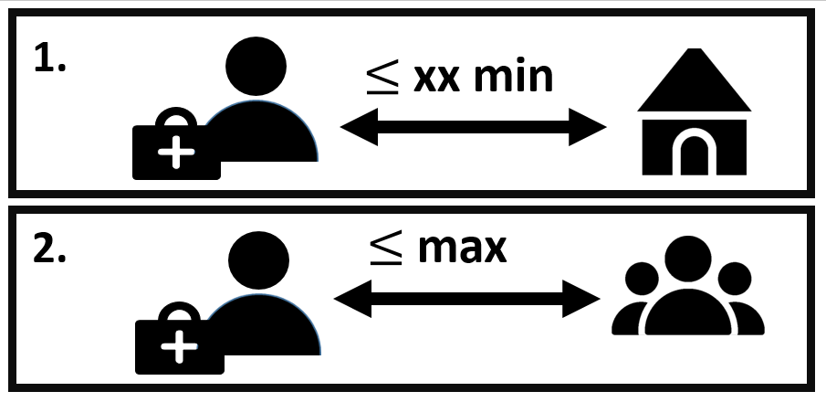

This R package contains functions that can be used to compute CHW placement scenarios, based on gridded population surfaces, friction surfaces and additional datasets such as GPS coordinates of existing health facilities.

These functions are based on the CLSCP optimisation programme by @current_storbeck1988. Further details on the methodology can be found in the associated manuscript.

```{r pressure, echo=FALSE, out.width = '60%'}

```


The CHW placement scenarios are designed to find the minimum number of CHWs required to reach full population coverage under two constraints:

1. the travel time between the CHWs and the households remains below a given time

2. the population assigned to each CHW remains below a given threshold

The algorithm provides the total number of CHWs required and their GPS positions.


## How to use the package

### First steps and preparation of model inputs
First the package needs to be loaded.

```{r, include = FALSE}
knitr::opts_chunk$set(
  collapse = TRUE,
  comment = "#>"
)
```

```{r setup}

library(CHWplacement)
#library(igraph)
library(rgeos)
library(rasterVis)
library(ggplot2)
library(cowplot)
```

 The optimisation requires 5 inputs:
                     
 - **population.raster**: a population gridded surface, representing population distribution
 
 - **friction.raster**: a friction surface (for example, the surface by @weiss2020 that can be downloaded from the malariaAtlas R package @malariaatlas_package), representing the difficulty to cross one pixel in the maps (e.g. in minutes to cross one meter)
 
 - **access.raster**: a raster surface indicating areas to be included in the algorithm, e.g. accessibility to health facilities (for example, the surface by @weiss2020 that can be downloaded from the malariaAtlas R package @malariaatlas_package)
 
 - **popurb.raster**: a raster surface indicating the positioning of urban areas (for example, as derived using the DefineUrban function) 
 
 - **shp**: a polygon shapefile indicating the area to be considered for optimisation
 

For this example, we will demonstrate with fictitious data, but the user's data should be used instead.
```{r }

  newproj= "+proj=longlat +datum=WGS84 +no_defs +ellps=WGS84"
  pop.dummy=raster::raster( matrix(c(rep(30,125), rep(90,100)), ncol=15))
  fric.dummy=raster::raster(matrix(rep(0.02,225), ncol=15))
  acc.dummy=raster::raster(matrix(c(rep(30,175), rep(90,50)), byrow=T, ncol=15))
  shp.dummy <- as(raster::extent(pop.dummy), 'SpatialPolygons')
  raster::crs(pop.dummy)=newproj
  raster::crs(fric.dummy)=newproj
  raster::crs(acc.dummy)=newproj
  names(acc.dummy)=""
  
```

The raster file indicating the position of urban areas can be created following the “degree of urbanization approach” described in the 2017 World Bank report -@world_bank_report to define urban and rural areas, with the **DefineUrban** function. The parameter **rururb_cutoff** indicates the minimum population density for each pixel considered as urban. The parameter **min_urbsize** indicates the minimum population in the total area of contiguous selected pixels to be considered as urban. The user can also use any raster file created with another methodology.

```{r }

  urb.dummy = DefineUrban( pop.dummy, rururb_cutoff = 50, min_urbsize = 1000)

```

We can first visualise this fictitious data, using the following plotting packages:

```{r, message=FALSE, warning=FALSE }

plot_pop = gplot(pop.dummy)+
  geom_tile(aes(fill=factor(value)), alpha=0.6) +coord_equal()+scale_fill_manual(values=c("#FF6600", "#990000"), name = "Population")

plot_acc = gplot(acc.dummy)+
  geom_tile(aes(fill=factor(value)), alpha=0.6) +coord_equal()+scale_fill_manual(values=c("forestgreen", "darkorange"), name="Access")

plot_urb = gplot(urb.dummy)+
  geom_tile(aes(fill=factor(value)), alpha=0.6) +coord_equal()+scale_fill_manual( values=c("#990000"), name="Urban\npopulation")

plot_fric = gplot(fric.dummy)+
  geom_tile(aes(fill=factor(value)), alpha=0.6) +coord_equal()+scale_fill_manual(values=c("#FFCC00"), name="Friction")
```

In this fictitious population, we have 12750 people, 9000 of them living in an urban area. The southern areas is considered to be hard-to-reach (orange, as opposed to green). This represents 720 individuals in the rural area, and 2340 in the urban area. The friction is uniform.

```{r, fig.width = 6, fig.align="center"}
plot_grid(plot_pop, plot_fric, plot_acc, plot_urb)
```

### Creating a CHW placement scenario on a simple example
These elements are combined to provide the minimal number of CHWs and their optimal geographical positioning to guarantee full population coverage verifying the following constraints:

 - **Maximum travel time**: the travel time between the CHW and their assigned inhabitants remains below a certain time (called "radius")
 
 - **Maximium population**: the maximal number of inhabitant per CHWs remains below a certain capacity threshold, that can differ in urban ("max.treat.per.CHW.urban") and rural ("max.treat.per.CHW.rural") areas
 
 - **Area selection**: the analysis can be restricted to certain areas in the access.raster map via the "buffer" and "is.inside" parameters: for example if access.raster represents the travel time to health facilities in min, the analysis can restricted to areas situated at more than 60 min from any health facility (buffer=60 and is.inside=FALSE), or areas situated at less than 60 min from  from any health facility (buffer=60 and is.inside=TRUE)


The CHW plan can be defined with the following function:
```{r }

CreateCHWplacement( population.raster=pop.dummy, friction.raster=fric.dummy,shp=shp.dummy,
                     name="temp", buffer=60, radius=600, capacity.name="",
                     access.raster=acc.dummy,popurb.raster=urb.dummy,
                     max.treat.per.CHW.urban=2000, max.treat.per.CHW.rural=1000,
                     max.CHW.per.pixel=10, is.inside = FALSE, filepath=".")

```
This function will create a file called temp.mps, stored in the repository indicated by filepath. This files contains the description of the optimisation problem, that can then be solved by an optimisation algorithm. For example, the problem can be solved in R with the lpSolveAPI package, with the following function:

```{r }
CHWanswer=solve_CHWplacement(population.raster=pop.dummy, friction.raster=fric.dummy,shp=shp.dummy,
                                        name="temp", buffer=60, radius=600, capacity.name="",
                                        access.raster=acc.dummy,popurb.raster=urb.dummy,
                                        is.inside = FALSE, filepath=".")
```
3 CHWs are needed to cover the area.
The package returns a new data.frame with one line per assigned CHW, with the associated GPS coordinates (x and y), whether their are positioned in rural area (is.rural=1 in rural areas and 0 in urban areas), and their associated number of people assigned (capacity). The sum of all CHW capacities is above the total population in the area, due to overlapping catchment areas in this example.
```{r }
CHWanswer
```
We can represent these results graphically. To improve interpretability, we will plot a masked version of the population raster, where all areas not included in the analysis (following the buffer parameter) are replaced by NA. Such a map can be obtained as one of the outcomes of the function PrepareRasterFiles.

```{r }
all.rasters=PrepareRasterFiles(population.raster=pop.dummy, friction.raster=fric.dummy,shp=shp.dummy,
                                        buffer=60, 
                                        access.raster=acc.dummy,popurb.raster=urb.dummy,
                                        is.inside = FALSE)
```

We use the rasters to represent the results graphically:

```{r , fig.width = 5, fig.align="center"}

gplot(all.rasters$pop.map)+
  geom_tile(aes(fill=factor(value)), alpha=0.6) +scale_fill_manual(values=c("#FF6600", "#990000"), name="Population") + 
  geom_point(data=CHWanswer, aes(x=x, y=y))+
  coord_equal()

```
We can also plot the catchment area of each CHW and see that all population points are covered. These cathcment areas correspond to a distance of 600 min (radius) form the CHW location. The catchment areas do overlap, and in practice, they would need to be adapted individually knowing the local geographical context when CHWs are recruited.

```{r , fig.width = 5, fig.align="center"}
footprint1=GetFootprintWalkingTime(pos=CHWanswer[1,1:2], radius=600, pop.map=all.rasters$pop.map, T.GC=all.rasters$T.GC)
footprint1b=raster::xyFromCell(all.rasters$pop.map,footprint1)
footprint2=GetFootprintWalkingTime(pos=CHWanswer[2,1:2], radius=600, pop.map=all.rasters$pop.map, T.GC=all.rasters$T.GC)
footprint2b=raster::xyFromCell(all.rasters$pop.map,footprint2)
footprint3=GetFootprintWalkingTime(pos=CHWanswer[3,1:2], radius=600, pop.map=all.rasters$pop.map, T.GC=all.rasters$T.GC)
footprint3b=raster::xyFromCell(all.rasters$pop.map,footprint3)

gplot(all.rasters$pop.map)+
  geom_tile(aes(fill=factor(value)), alpha=0.6) +scale_fill_manual(values=c("#FF6600", "#990000"), name="Population") + 
  geom_point(data=as.data.frame(footprint1b), aes(x=x, y=y), color="darkblue")+
  geom_point(data=as.data.frame(footprint2b), aes(x=x, y=y), color="dodgerblue")+
  geom_point(data=as.data.frame(footprint3b), aes(x=x, y=y), color="lightblue")+
  geom_point(data=CHWanswer, aes(x=x, y=y), size=2)+
  coord_equal()

```

### Using the package in practice with large maps

Solving the model with the R software and the lpSolveAPI package can become very computationally intense for the problems to be solved in practice (larger maps and more difficult optimisation constraints). In this context, other softwares can be used, such as @gurobi or SCIP (@scip1, @scip2). 

#### Some limitations

Time limitations and size limitation are caused by the creation and .mps by the lpSolveAPI package. 
For large problems the .mps file creation can be lengthy.
Additonally, there can't be more than 9 999 999 decision variables, because the name of columns i.e. decision variables in .mps have a limited length (after that threshold, C10000001 and C10000002 become C1000000 which raises error).


#### Using SCIP

SCIP is an open source solver whose performance is greater than lpSolveAPI on large problems. It needs to be downloaded and installed [here](https://www.scipopt.org/index.php#download). You can indicate which version of SCIP was downloaded as follows:

```{r SCIP version for windows users}

############### CHANGE THAT: ##################################

SCIP_version = "7.0.3"

###############################################################


```
The CHW plan can be defined similarly to the previous examples, with the following function:

```{r }
# mps_directory_H2 = file.path("clscp_600_buffer60_capa")

CreateCHWplacement_SCIP( population.raster = pop.dummy,
                       friction.raster  = fric.dummy,
                       access.raster    = acc.dummy,
                       popurb.raster    = urb.dummy,
                       shp = shp.dummy,
                       filepath = ".",
                       name = "SCIPtemp",
                       buffer = 60, radius = 600, capacity.name="",
                       max.treat.per.CHW.urban = 2000, max.treat.per.CHW.rural = 1000,
                       max.CHW.per.pixel = 10, is.inside = FALSE,
                       dualitygap = 0,           # a maximum error CHW because global solutions
                       relativegap = F,          # sometimes can't be caculated in a resonable duration
                       SCIP_version = SCIP_version)

```
This function will create a file called SCIPtemp.mps, stored in the repository indicated by filepath. This files contains the description of the optimization problem.   

Then it will create a .txt file with the basic script you need in order to calculate the solution by using SCIP shell. The two additional options (dualitygap and relativegap are specific SCIP parameters as detailed in the function documentation).

```{r , comment=''}
cat(readLines('clscp_600_buffer60_capa/SCIP_script_SCIPtemp.txt'), sep = '\n')
```
This text file contains two parts. The first part (Manual use of SCIP) gives the commands to type in the SCIP command line to solve the problem. The second part (Automated use of SCIP version 7.0.3( for Windows users )) gives a script that can be directly copy-pasted in the Windows powershell to solve the optimisation problem with SCIP. This will create a .sol file in the same repository, containing the solution of the optimisation problem.   

If you already have a .mps file, you can use the function **CreateScriptSCIP**, which only creates the .txt file. It can be useful if you want to recreate scripts for an older .mps file.
```{r CreatScript4SCIP }
CreateScriptSCIP( mps_directory = "clscp_600_buffer60_capa", name = "SCIPtemp", dualitygap = 0, relativegap = F )

```


```{r, echo=FALSE, ,results='hide'}
 cat( 
"solution status: optimal solution found
objective value:                                    3
C46                                                 1 	(obj:1)
C39                                                 1 	(obj:1)
C32                                                 1 	(obj:1)
C82                                                 1 	(obj:0)
C146                                                1 	(obj:0)
C182                                                1 	(obj:0)
C232                                                1 	(obj:0)
C282                                                1 	(obj:0)
C339                                                1 	(obj:0)
C389                                                1 	(obj:0)
C439                                                1 	(obj:0)
C489                                                1 	(obj:0)
C539                                                1 	(obj:0)
C589                                                1 	(obj:0)
C639                                                1 	(obj:0)
C696                                                1 	(obj:0)
C732                                                1 	(obj:0)
C796                                                1 	(obj:0)
C832                                                1 	(obj:0)
C896                                                1 	(obj:0)
C946                                                1 	(obj:0)
C996                                                1 	(obj:0)
C1032                                               1 	(obj:0)
C1089                                               1 	(obj:0)
C1139                                               1 	(obj:0)
C1189                                               1 	(obj:0)
C1239                                               1 	(obj:0)
C1289                                               1 	(obj:0)
C1339                                               1 	(obj:0)
C1389                                               1 	(obj:0)
C1446                                               1 	(obj:0)
C1482                                               1 	(obj:0)
C1496                                               1 	(obj:0)
C1546                                               1 	(obj:0)
C1596                                               1 	(obj:0)
C1632                                               1 	(obj:0)
C1682                                               1 	(obj:0)
C1696                                               1 	(obj:0)
C1746                                               1 	(obj:0)
C1782                                               1 	(obj:0)
C1839                                               1 	(obj:0)
C1889                                               1 	(obj:0)
C1939                                               1 	(obj:0)
C1989                                               1 	(obj:0)
C2039                                               1 	(obj:0)
C2089                               0.999999999999999 	(obj:0)
C2146                               0.999999999999999 	(obj:0)
C2196                                               1 	(obj:0)
C2232                                               1 	(obj:0)
C2246                                               1 	(obj:0)
C2296                                               1 	(obj:0)
C2332                                               1 	(obj:0)
C2382                                               1 	(obj:0)
C2432                                               1 	(obj:0)
C2482                                               1 	(obj:0)
C2496                                               1 	(obj:0)
C2532                                               1 	(obj:0)
"    , sep = "", file = file.path("clscp_600_buffer60_capa","SCIPtemp_solutions.sol")
  )

```


Now you have a file temp_solution.sol and the next step is to decode it. Make sure you use exactly the same input rasters as the ones used in **CreateCHWplacement_SCIP**. 

```{r Read the result}

CHWanswer = read_CHWplacement_sol_SCIP(  population.raster = pop.dummy,
                              friction.raster  = fric.dummy,
                              access.raster    = acc.dummy,
                              popurb.raster    = urb.dummy,
                              shp = shp.dummy,
                              name = "SCIPtemp" ,
                              filepath = ".",
                              buffer=60, is.inside = F, radius=600, capacity.name = "",
                              write = F  # creates a CSV file of the results
                              )
```

This will return a dataframe file containing the CHW positions (it can be saved as .csv file with the option write=T).

3 CHWs are needed to cover the area: the solution is slightly different from the previous one, but it equally verifies the chosen constraints (walking time and capacities).

```{r }
CHWanswer
```
  

```{r , fig.width = 5, fig.align="center"}
gplot(all.rasters$pop.map)+
  geom_tile(aes(fill=factor(value)), alpha=0.6) +scale_fill_manual(values=c("#FF6600", "#990000"), name="Population") + 
  geom_point(data=CHWanswer, aes(x=x, y=y))+
  coord_equal()

```


#### Using Gurobi
The .mps file created previously can also be solved with Gurobi, and the solution will be provided as a .sol file. This .sol file can be read with R using the function **read_CHWplacement_sol**.


## References
